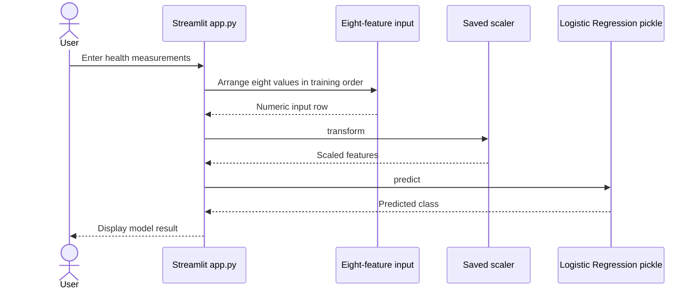

# GTC Diabetes Prediction

A GTC internship classification project with a Streamlit interface using a saved Logistic Regression model and scaler.

**Technology:** Python · scikit-learn · pandas · NumPy · Streamlit

## Features

- Enter eight features: pregnancies, glucose, blood pressure, skin thickness, insulin, BMI, diabetes pedigree function, and age.
- Apply the fitted scaler before Logistic Regression inference.
- Explore several classifiers with GridSearchCV in the training notebook.

## Repository guide

| Path | Purpose |
|---|---|
| [app.py](app.py) | Input form, scaling, and predictions. |
| [diabetes-prediction.ipynb](diabetes-prediction.ipynb) | EDA, preprocessing, and model selection. |
| [best_model_logistic_regression.pkl](best_model_logistic_regression.pkl) | Saved classifier. |
| [scaler (1).pkl](scaler%20%281%29.pkl) | Fitted scaler. |
| [diabetes - diabetes.csv](diabetes%20-%20diabetes.csv) | Dataset. |
| [requirements.txt](requirements.txt) | Runtime dependencies. |

## Requirements and current limitations

Run from the root so both artifact filenames resolve, including the space and parentheses in `scaler (1).pkl`. Keep the scaler, feature order, and classifier from the same training run. Update the notebook's Kaggle path to the included CSV when running locally.

This project demonstrates dataset-based classification and is not a clinical diagnostic tool.

## UML diagrams

### Main workflow

The committed scaler transforms the eight input measurements before Logistic Regression inference.



## Getting started

```bash
git clone https://github.com/IbrahimAbdelsattar/GTC-ML-Internship-Diabetes-Prediction.git
cd GTC-ML-Internship-Diabetes-Prediction
```

Use a Python virtual environment:

```bash
python -m venv .venv
```

Activate it with `source .venv/bin/activate` on macOS/Linux or `.venv\Scripts\Activate.ps1` in PowerShell.

```bash
python -m pip install -r requirements.txt
python -m streamlit run app.py
```
